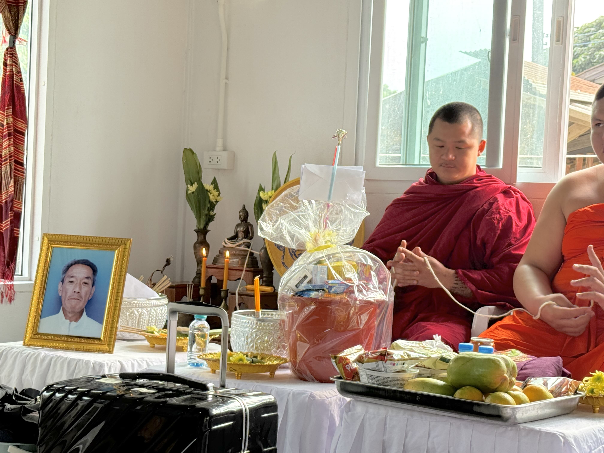
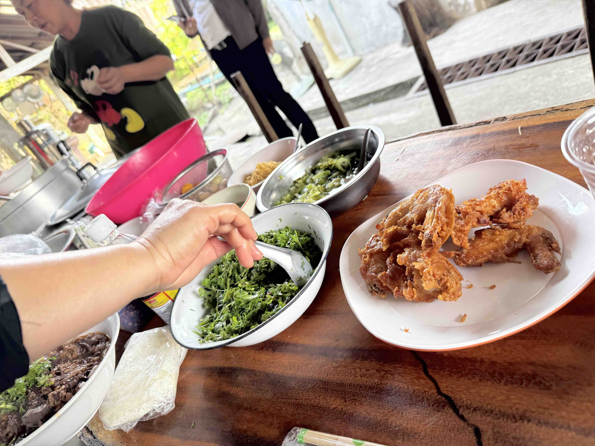

# 20250129_chiangrai

<html>
<head>

<meta charset="UTF-8">
<meta http-equiv="Content-Type" content="text/html; charset=UTF-8">
<meta http-equiv="X-UA-Compatible" content="IE=EmulateIE10" />
<meta http-equiv="X-UA-Compatible" content="IE=edge">

<!--ここから上はお決まりの定型文です-->

<!--ここからが表現の書式などを決めるcssという部分-->

<link href="https://cdnjs.cloudflare.com/ajax/libs/lightbox2/2.7.1/css/lightbox.css" rel="stylesheet">

</head>

<body>

モバイル端末をお使いの場合は、画面を横向きにすると
より見やすくご覧頂けます。

<!--ここ上は、ほぼそのまま使います！-->

<!--QRコードの挿入例-->

 アクセス用QRコード

<marquee direction="left" scrollamount="20" width="30%">(^_^)/~alis</marquee>

<!--流れ文字の挿入例-->
<h1><marquee behavior="left">!!! 2025/01/29、朝は曇り空、お坊さんが5人も来て故人の供養、アヒルのヒナは無事家族に合流!!!</marquee></h1>

                          

<!--ここから下が、本体部分-->

<h2>朝は曇り空、今日は故人の供養の日</h2>

    
<h2>朝から供養の準備です</h2>

    
<h2>9:30にはお坊さんが到着しました</h2>

    
<h2>手前の僧侶はまだ子供。 家庭の経済的理由で仏門に預けられて、義務教育も仏門系で受けるとのこと。 日本にもこのシステムあった方が良いかも・・・</h2>

    
<h2>最後は手首に紐を巻いてもらって終わります</h2>

    
<h2>日本人(コン・ニィープン)にもしっかり巻いてくれました</h2>

    
<h2>10:15には供養も無事終了</h2>

    
<h2>庭には初めて見るお花が咲きました</h2>

    
<h2>供養の後は親族だけで食事会</h2>

    
<h2>供養の様子は動画で撮影(かなり長編) 白い服の方は一般人とお坊さの中継ぎ役で、集落に必ず何人かおられるとのこと 一連の流れの中で驚くのは、一般人側もお経を暗記していていて、僧侶とのお経掛け合いみたいになるところ 成人までの過程でお寺での修行義務がある国ならではです</h2>
    
<iframe width="560" height="315" src="https://www.youtube.com/embed/_GOlFq_HHM8?si=dxS5anCgzwJ15MQe" title="YouTube video player" frameborder="0" allow="accelerometer; autoplay; clipboard-write; encrypted-media; gyroscope; picture-in-picture; web-share" referrerpolicy="strict-origin-when-cross-origin" allowfullscreen></iframe> 
    
<iframe width="560" height="315" src="https://www.youtube.com/embed/HRhDqZN9uag?si=pDaqV-XfMJjG1XOt" title="YouTube video player" frameborder="0" allow="accelerometer; autoplay; clipboard-write; encrypted-media; gyroscope; picture-in-picture; web-share" referrerpolicy="strict-origin-when-cross-origin" allowfullscreen></iframe> 
    
<iframe width="560" height="315" src="https://www.youtube.com/embed/GCaIkS6WzNg?si=8aQS173eGf_1Mv7r" title="YouTube video player" frameborder="0" allow="accelerometer; autoplay; clipboard-write; encrypted-media; gyroscope; picture-in-picture; web-share" referrerpolicy="strict-origin-when-cross-origin" allowfullscreen></iframe> 

<h2>若い修行僧は、お経忘れて確認する場面も・・・</h2>
<iframe width="560" height="315" src="https://www.youtube.com/embed/ncIPAk9b_NA?si=GYxdZ_V-LIpzj_cS" title="YouTube video player" frameborder="0" allow="accelerometer; autoplay; clipboard-write; encrypted-media; gyroscope; picture-in-picture; web-share" referrerpolicy="strict-origin-when-cross-origin" allowfullscreen></iframe> 
    
<h2>動画中ほどで僧侶を繋いでいた紐を回収するシーンあり</h2>
<iframe width="560" height="315" src="https://www.youtube.com/embed/nX19nMLGazY?si=o7h4m5F_Y6jEc71v" title="YouTube video player" frameborder="0" allow="accelerometer; autoplay; clipboard-write; encrypted-media; gyroscope; picture-in-picture; web-share" referrerpolicy="strict-origin-when-cross-origin" allowfullscreen></iframe> 
    
<iframe width="560" height="315" src="https://www.youtube.com/embed/t8AszjCNaqM?si=61U3w0kBS4EnSr34" title="YouTube video player" frameborder="0" allow="accelerometer; autoplay; clipboard-write; encrypted-media; gyroscope; picture-in-picture; web-share" referrerpolicy="strict-origin-when-cross-origin" allowfullscreen></iframe> 

<iframe width="560" height="315" src="https://www.youtube.com/embed/-A6lxrk63OQ?si=3AoZn-G5Ee5rLOkY" title="YouTube video player" frameborder="0" allow="accelerometer; autoplay; clipboard-write; encrypted-media; gyroscope; picture-in-picture; web-share" referrerpolicy="strict-origin-when-cross-origin" allowfullscreen></iframe> 
    
<h2>昨日兄弟と慣らしたアヒルは無事群れに合流</h2>

    
<h2>ニワトリ家蔵はいつも通り</h2>

    
<h2>夕食の時間も故人の弔いで集まって食事・・・20時過ぎまで続きました</h2>

    
<h2>夕焼けはオレンジグラデーションで暮れました</h2>

<h2>今夜のBGMはユーミンのピアノ 旋律聴くだけで歌詞がかなり正確に頭に浮かんできました リアルタイムで聴いてたのは多分50年前？！</h2>
<iframe width="560" height="315" src="https://www.youtube.com/embed/ff7lPqk6-aU?si=hKOi_NUg8rr4eu-u" title="YouTube video player" frameborder="0" allow="accelerometer; autoplay; clipboard-write; encrypted-media; gyroscope; picture-in-picture; web-share" referrerpolicy="strict-origin-when-cross-origin" allowfullscreen></iframe> 

<h2>ユーミンのピアノに聴き入る猫達 さすがユーミン、種を超えて心に染み込めるとは！</h2>

   
<h2>以上、曇り空でスタートして故人の供養でドタバタした1日でした。 アヒルのヒナは無事群れに合流して一安心。 ここまで観ていただきありがとうございました。</h2>

     
<h2>
<a href="https://torokoid.github.io/20241126_chiangrai/" target="_blank">Back to the menu page</a>
</h2>

   

         

  

      

<!--本体はここまで-->

<!--画面に空白地帯を作って、背景が見えるようにしています-->
                                              

<!-- フッタ -->
<footer>

Copyright 2025/01/30 alis @ChiangRai

</footer>

<!--HPにさまざまなJavaScriptを呼び込むための書式-->

